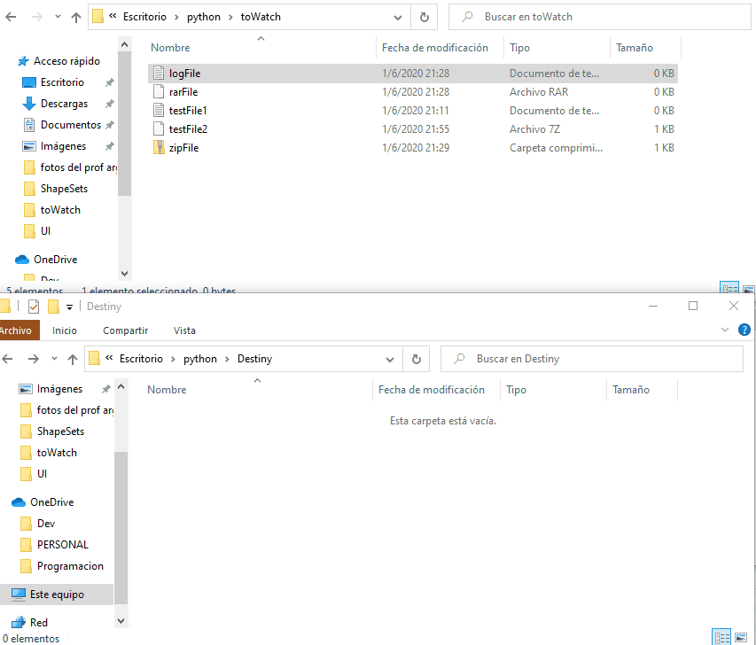

# Python File Sorter Tool

A simple python script that watch the files under a folder and send it to another folder specified,
it will create subfolders in the target location based on the file extension so you can keep your files in order.

